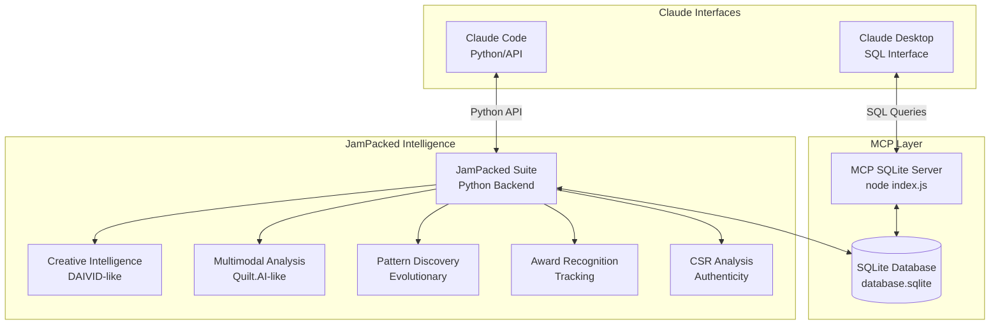
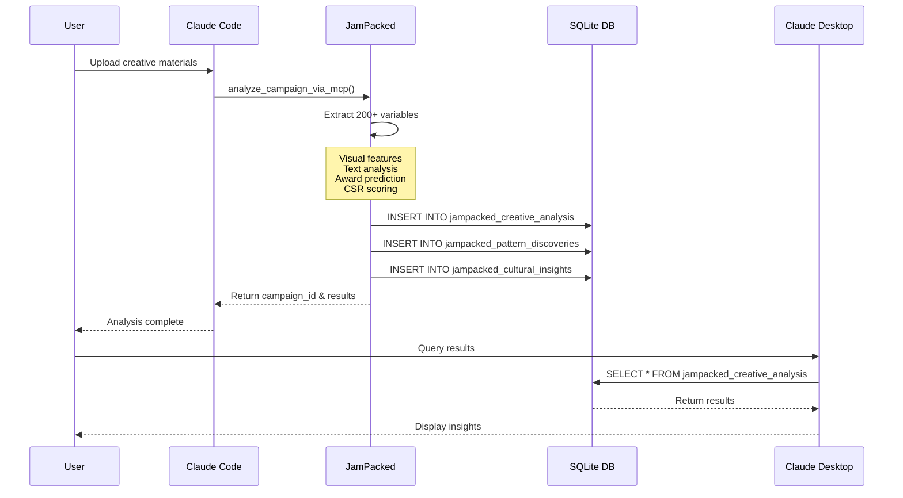
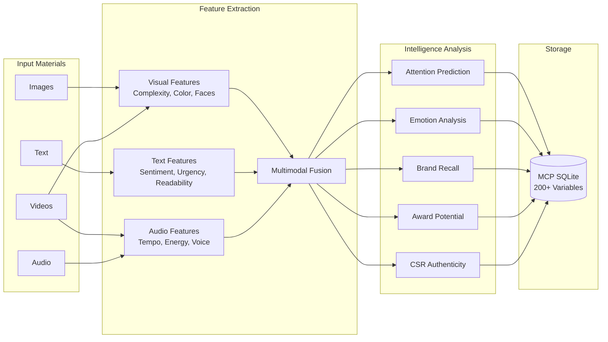
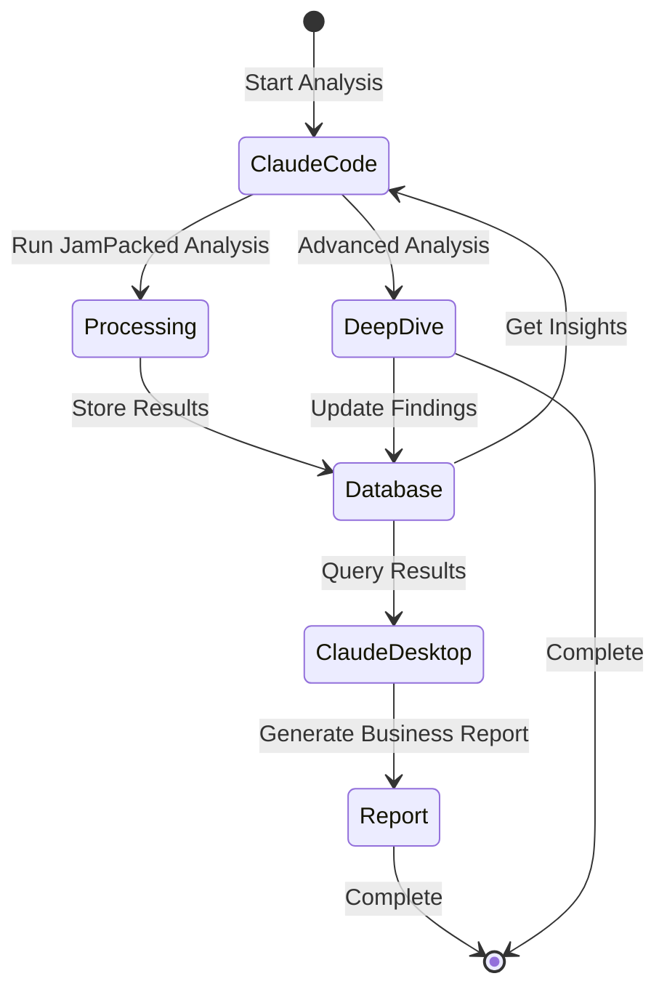
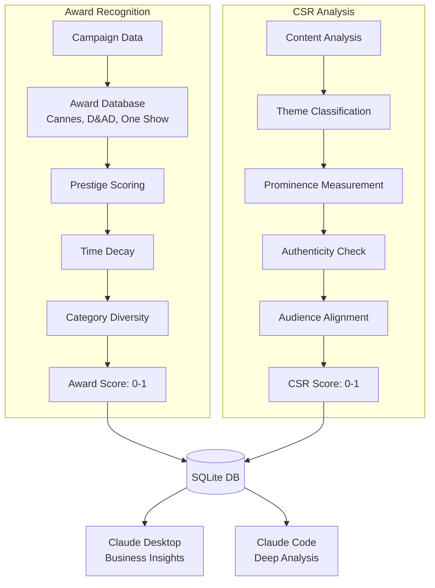
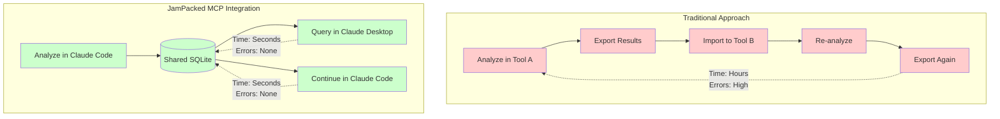

# MCP Integration Flow Diagrams

## 1. Overall Architecture



## 2. Data Flow Example



## 3. Variable Extraction Pipeline



## 4. Cross-Interface Workflow



## 5. Award & CSR Analysis Flow



## 6. Real-time Integration Benefits



## Key Integration Points

### 1. **Database Location**
```
/Users/pulser/Documents/GitHub/mcp-sqlite-server/data/database.sqlite
```

### 2. **MCP Server**
```
/Users/pulser/Documents/GitHub/mcp-sqlite-server/dist/index.js
```

### 3. **JamPacked Integration**
```python
from jampacked_sqlite_integration import analyze_campaign_via_mcp
```

### 4. **SQL Access**
```sql
SELECT * FROM jampacked_creative_analysis;
SELECT * FROM jampacked_pattern_discoveries;
SELECT * FROM jampacked_cultural_insights;
SELECT * FROM jampacked_optimizations;
```

This architecture enables seamless, real-time collaboration between Claude Desktop and Claude Code while leveraging the full power of JamPacked's creative intelligence capabilities!